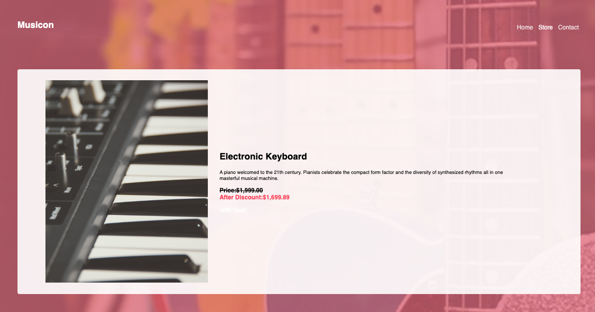

# musicon-store

### **Description:**
This is a virtual marketplace application that allows visitors to browse musical instruments for purchase. It uses JavaScript logic and Handlebars to dynamically update the price and information pertaining to specific items based on whether the listed items are on sale or not. The backend logic to actually make online purchases is not setup, but users can browse for items, then utilize the contact page in order to call or email the store to place an order.
 

_____

### **Using the App in google chrome**
* This application is extremely easy to use. Simply open the app in the browser and use the provided navigation bar to shop for musical instruments! If an item is 'on sale', the normal price will be displayed, but stricken out by a line. The 'sale price' will be dynamically inserted just below the normal price. 
 

_____

### **Demo Screenshots**
##### Musicon-Store
* The Home page!

* The Store page!

* The Contact page!

 
_________

### **Technologies Used**
* HTML5
* CSS
* JavaScript
* Handlebars
* Google-Fonts
 

_____

### **Built With**
* Visual Studio Code
